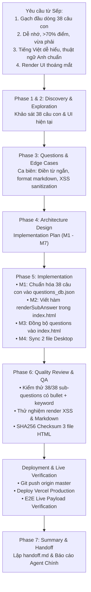

# 🔄 PIPELINE DIAGRAM: CHUẨN HÓA GẠCH ĐẦU DÒNG 38 ĐÁP ÁN CÂU CON & UI BULLET RENDER

```mermaid
flowchart TD
    A["Yêu cầu từ Sếp:<br/>1. Gạch đầu dòng 38 câu con<br/>2. Dễ nhớ, >70% điểm, vừa phải<br/>3. Tiếng Việt dễ hiểu, thuật ngữ Anh chuẩn<br/>4. Render UI thoáng mắt"] --> B["Phase 1 & 2: Discovery & Exploration<br/>Khảo sát 38 câu con & UI hiện tại"]
    
    B --> C["Phase 3: Questions & Edge Cases<br/>Ca biên: Điền từ ngắn, format markdown, XSS sanitization"]
    
    C --> D["Phase 4: Architecture Design<br/>Implementation Plan (M1 - M7)"]
    
    D --> E["Phase 5: Implementation<br/>• M1: Chuẩn hóa 38 câu con vào questions_db.json<br/>• M2: Viết hàm renderSubAnswer trong index.html<br/>• M3: Đồng bộ questions vào index.html<br/>• M4: Sync 2 file Desktop"]
    
    E --> F["Phase 6: Quality Review & QA<br/>• Kiểm thử 38/38 sub-questions có bullet + keyword<br/>• Thử nghiệm render XSS & Markdown<br/>• SHA256 Checksum 3 file HTML"]
    
    F --> G["Deployment & Live Verification<br/>• Git push origin master<br/>• Deploy Vercel Production<br/>• E2E Live Payload Verification"]
    
    G --> H["Phase 7: Summary & Handoff<br/>Lập handoff.md & Báo cáo Agent Chính"]
```
