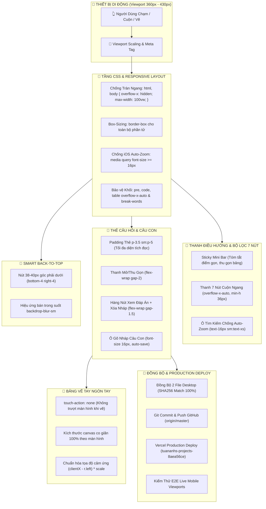

# 📊 SƠ ĐỒ LUỒNG KIẾN TRÚC TỐI ƯU MOBILE (PIPELINE DIAGRAM)

```mermaid
flowchart TD
    subgraph MobileDevice["📱 THIẾT BỊ DI ĐỘNG (Viewport 360px - 430px)"]
        UserTouch["👆 Người Dùng Chạm / Cuộn / Vẽ"]
        Viewport["📐 Viewport Scaling & Meta Tag"]
    end

    subgraph CSS_Engine["🎨 TẦNG CSS & RESPONSIVE LAYOUT"]
        GlobalOverflow["Chống Tràn Ngang: html, body { overflow-x: hidden; max-width: 100vw; }"]
        BoxSizing["Box-Sizing: border-box cho toàn bộ phần tử"]
        FontZoomBlock["Chống iOS Auto-Zoom: media query font-size >= 16px"]
        CodeTableProtect["Bảo vệ Khối: pre, code, table overflow-x-auto & break-words"]
    end

    subgraph Header_Nav["🧭 THANH ĐIỀU HƯỚNG & BỘ LỌC 7 NÚT"]
        MiniHeader["Sticky Mini Bar (Tóm tắt điểm gọn, thu gọn bảng)"]
        ScrollableFilter["Thanh 7 Nút Cuộn Ngang (overflow-x-auto, min-h 36px)"]
        SearchInput["Ô Tìm Kiếm Chống Auto-Zoom (text-16px sm:text-xs)"]
    end

    subgraph Card_Interaction["📝 THẺ CÂU HỎI & CÂU CON"]
        CardPadding["Padding Thẻ p-3.5 sm:p-5 (Tối đa diện tích đọc)"]
        SubQuestionToolbar["Thanh Mở/Thu Gọn (flex-wrap gap-2)"]
        SubButtons["Hàng Nút Xem Đáp Án + Xóa Nháp (flex-wrap gap-1.5)"]
        SubTextarea["Ô Gõ Nháp Câu Con (font-size 16px, auto-save)"]
    end

    subgraph Canvas_Engine["🎨 BẢNG VẼ TAY NGÓN TAY"]
        TouchAction["touch-action: none (Không trượt màn hình khi vẽ)"]
        ResponsiveCanvas["Kích thước canvas co giãn 100% theo màn hình"]
        CoordScale["Chuẩn hóa tọa độ cảm ứng (clientX - r.left) * scale"]
    end

    subgraph BackToTop_Module["🚀 SMART BACK-TO-TOP"]
        FloatingBtn["Nút 38-40px góc phải dưới (bottom-4 right-4)"]
        Glassmorphism["Hiệu ứng bán trong suốt backdrop-blur-sm"]
    end

    subgraph Deployment_Pipeline["🚀 ĐỒNG BỘ & PRODUCTION DEPLOY"]
        SyncDesktop["Đồng Bộ 2 File Desktop (SHA256 Match 100%)"]
        GitCommit["Git Commit & Push GitHub (origin/master)"]
        VercelProd["Vercel Production Deploy (tuananhs-projects-8aea56ce)"]
        LiveTest["Kiểm Thử E2E Live Mobile Viewports"]
    end

    UserTouch --> Viewport
    Viewport --> CSS_Engine
    CSS_Engine --> Header_Nav
    CSS_Engine --> Card_Interaction
    Card_Interaction --> Canvas_Engine
    CSS_Engine --> BackToTop_Module
    Card_Interaction --> Deployment_Pipeline
```
