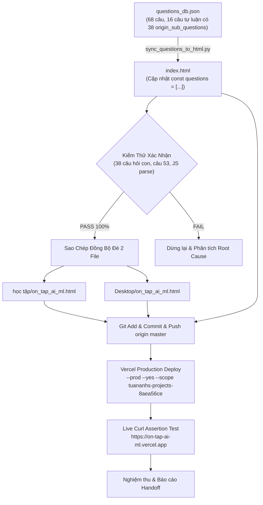

# 🔄 PIPELINE DIAGRAM: LUỒNG ĐỒNG BỘ & TRIỂN KHAI

```mermaid
graph TD
    A["questions_db.json<br/>(68 câu, 16 câu tự luận có 38 origin_sub_questions)"] -->|sync_questions_to_html.py| B["index.html<br/>(Cập nhật const questions = [...])"]
    B --> C{"Kiểm Thử Xác Nhận<br/>(38 câu hỏi con, câu 53, JS parse)"}
    C -->|PASS 100%| D["Sao Chép Đồng Bộ Đè 2 File"]
    D --> D1["học tập/on_tap_ai_ml.html"]
    D --> D2["Desktop/on_tap_ai_ml.html"]
    C -->|FAIL| ERR["Dừng lại & Phân tích Root Cause"]
    D1 & D2 & B --> E["Git Add & Commit & Push origin master"]
    E --> F["Vercel Production Deploy<br/>--prod --yes --scope tuananhs-projects-8aea56ce"]
    F --> G["Live Curl Assertion Test<br/>https://on-tap-ai-ml.vercel.app"]
    G --> H["Nghiệm thu & Báo cáo Handoff"]
```
